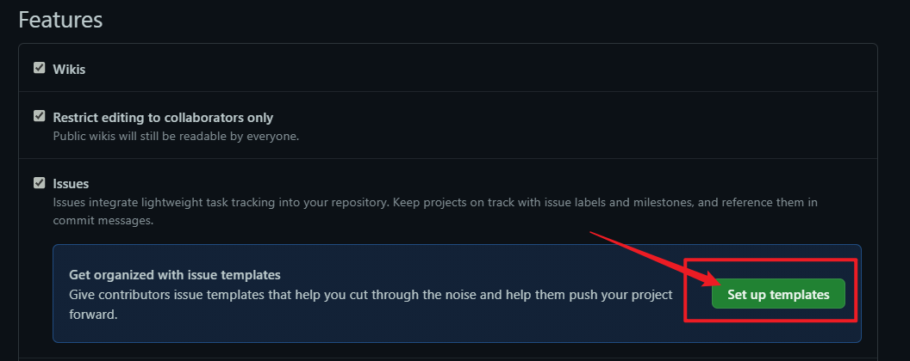
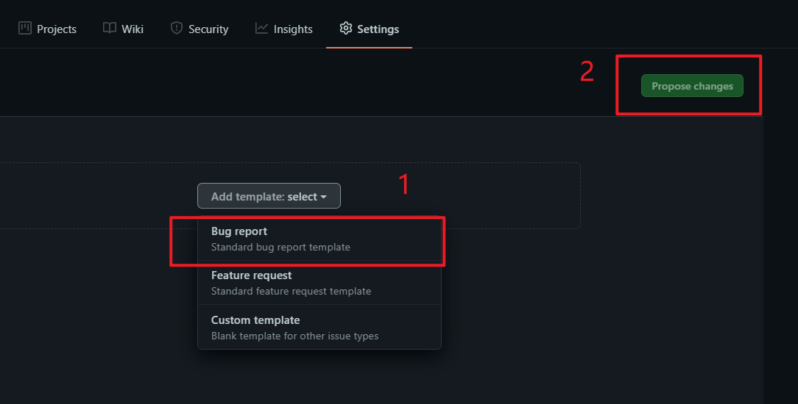
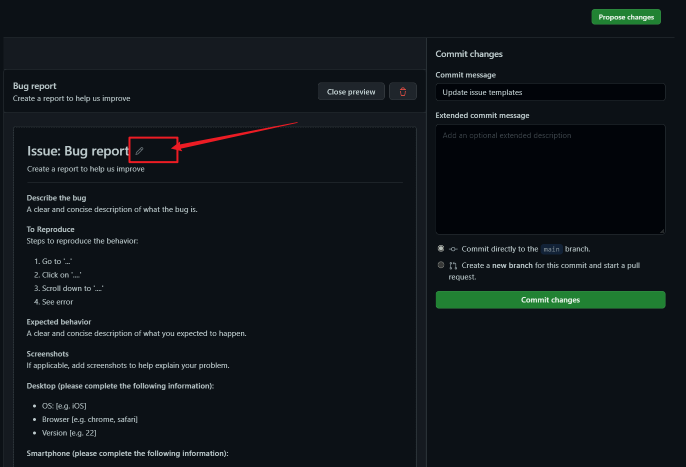
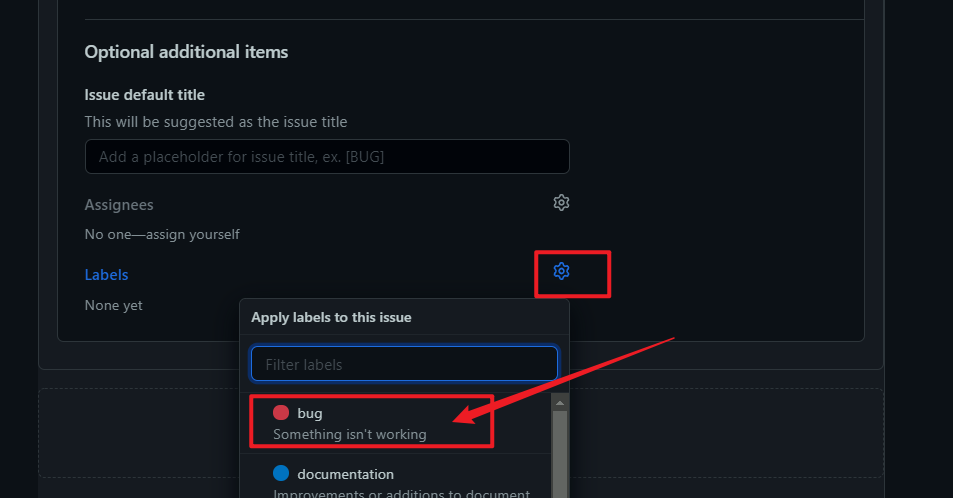
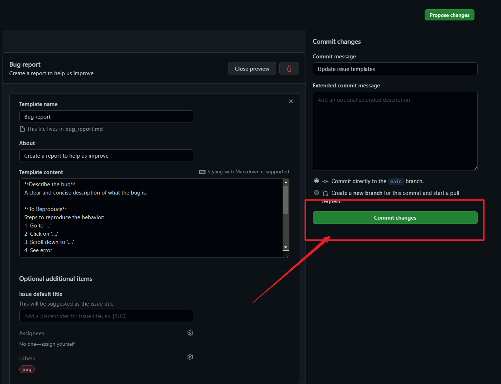
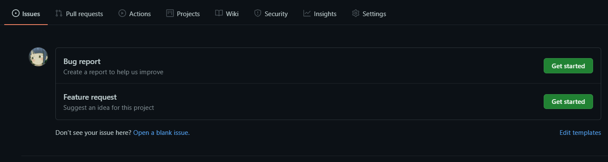
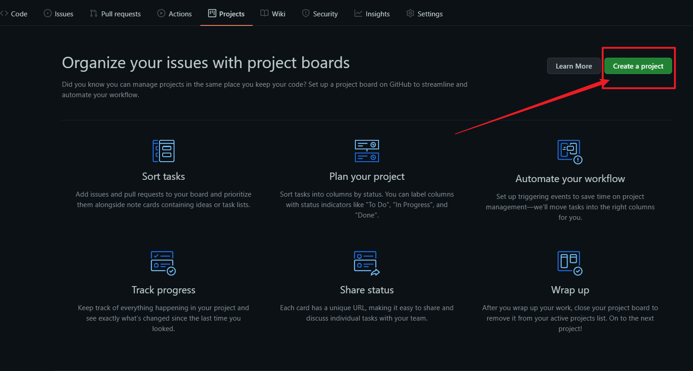
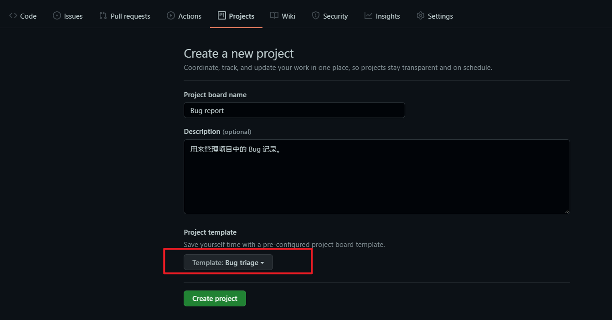
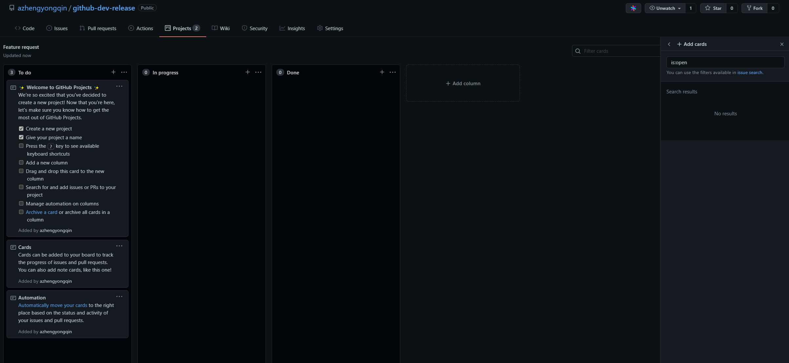

# Github 开发和打包流程

**Github** 已经完全给我们提供一个很方便的项目开发发布管理流程，这里用一个简单的Git项目来说明一下 **Github** 的一些常用的开发流程，主要包括 **Issues**、**commit**、 **Projects**、**Releases** 几个功能的配合使用。

本文中的例子全部基于这个仓库：https://github.com/azhengyongqin/github-dev-release


## 1. 创建Issues模板
给项目添加两个 **Issues** 模板：`Bug report`、`Feature request`。
- `Bug report:` 用来记录项目中需要修复的Bug。
- `Feature request:` 用来记录项目的一些新的功能需求建议。


创建流程：

1. 打开 **Github** 项目的 **Settings** 选项，点击如下按钮



2. 选择 **Bug report** --> **Propose changes**



3. 点击按钮编辑模板



按需要删除不必要的 **Template content**，例如只保留下面的内容：

```markdown
**Describe the bug**
A clear and concise description of what the bug is.

**To Reproduce**
Steps to reproduce the behavior:
1. Go to '...'
2. Click on '....'
3. Scroll down to '....'
4. See error

**Expected behavior**
A clear and concise description of what you expected to happen.

**Screenshots**
If applicable, add screenshots to help explain your problem.

**Additional context**
Add any other context about the problem here.

```

添加一个 **Labels**, 这里直接添加一个 `bug` , 添加完成后直接点击 **Commit changes** 完成创建。





用上面同样的方法添加一个 **Feature request** 模板，选择模板的 **Labels** 为：`enhancement` 。


创建完成后，回到项目的 **Issues** 选项卡，点击 **New issue** 就可以看到我们刚才创建的模板。




## 2. 创建 Projects 

给项目添加两个 **Projects** ：`Bug report`、`Feature request`。

- `Bug report:` 用来记录项目中需要修复的Bug，同时与 `Bug report` 模板类型的 **Issues** 进行关联。
- `Feature request:` 用来记录项目的一些新的功能需求建议，同时与 `Bug report` 模板类型的 **Issues** 进行关联。


创建流程：

1. 打开 **Github** 项目的 **Projects** 选项卡，点击如下按钮



2. 编辑 **Projects** , 选择 **Project template** 为 **Bug triage** 




用上面同样的方法添加一个 **Feature request** 的 **Projects**，选择 **Project template** 为 **Bug triage** 




## 3. 添加 Issues 和 Project 内容，并进行关联

