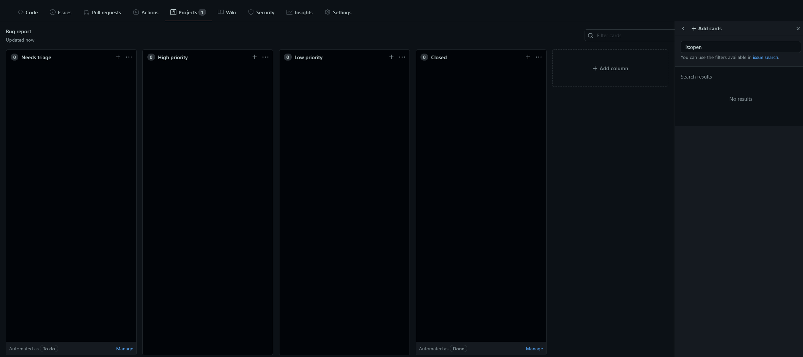

# Github 开发和打包流程

**Github** 已经完全给我们提供一个很方便的项目开发发布管理流程，这里用一个简单的Git项目来说明一下 **Github** 的一些常用的开发流程，主要包括 **Issues**、**commit**、 **Projects**、**Releases** 几个功能的配合使用。

本文中的例子全部基于这个仓库：https://github.com/azhengyongqin/github-dev-release


## 1. 创建Issues模板
给项目添加两个 **Issues** 模板：`Bug report`、`Feature request`。
- `Bug report:` 用来记录项目中需要修复的Bug。
- `Feature request:` 用来记录项目的一些新的功能需求建议。


创建流程：

1. 打开 **Github** 项目的 **Settings** 选项，点击如下按钮


2. 选择 **Bug report** --> **Propose changes**


3. 点击按钮编辑模板


按需要删除不必要的 **Template content**，例如只保留下面的内容：

```markdown
**Describe the bug**
A clear and concise description of what the bug is.

**To Reproduce**
Steps to reproduce the behavior:
1. Go to '...'
2. Click on '....'
3. Scroll down to '....'
4. See error

**Expected behavior**
A clear and concise description of what you expected to happen.

**Screenshots**
If applicable, add screenshots to help explain your problem.

**Additional context**
Add any other context about the problem here.

```

添加一个 **Labels**, 这里直接添加一个 `bug` , 添加完成后直接点击 **Commit changes** 完成创建。


用上面同样的方法添加一个 **Feature request** 模板，选择模板的 **Labels** 为：`enhancement` 。


创建完成后，回到项目的 **Issues** 选项卡，点击 **New issue** 就可以看到我们刚才创建的模板。


## 2. 创建 Projects 

给项目添加两个 **Projects** ：`Bug report`、`Feature request`。

- `Bug report:` 用来记录项目中需要修复的Bug，同时与 `Bug report` 模板类型的 **Issues** 进行关联。
- `Feature request:` 用来记录项目的一些新的功能需求建议，同时与 `Bug report` 模板类型的 **Issues** 进行关联。


创建流程：

1. 打开 **Github** 项目的 **Projects** 选项卡，点击如下按钮


2. 编辑 **Projects** , 选择 **Project template** 为 **Bug triage** 




用上面同样的方法添加一个 **Feature request** 的 **Projects**，选择 **Project template** 为 **Bug triage** 


## 3.创建一个 Bug report Issues 关联到Projects面板

进入项目 **Issues**  --> **New issue** --> 选择之前创建的 **Bug report** 模板 **Get started**


编辑 **Issues** 并且添加到 **Bug report Projects** 中，进行关联


添加成功后可以点击如下的位置进入，**Projects** 面板


## 4.3.创建一个 Bug report Project 关联到 Issues 

在 **But report project** 中添加一个新的项


关联成功后


## 5. 关闭Issues

当解决了**Bug Issues**后，可以手动关闭这个 **Issues**， 同时可以在描述中关联解决这个 **Issues** 的提交记录。


关闭后关联的 **Project** 会对这个 **Issues** 进行自动分类归档


## 6. 打包发布版本

### 6.1 先本地 **git** 中添加个 **tag**

>  `git tag` 命令文档：[2.6 Git 基础 - 打标签](https://git-scm.com/book/zh/v2/Git-%E5%9F%BA%E7%A1%80-%E6%89%93%E6%A0%87%E7%AD%BE)
>
> 语义化版本规范说明：[https://semver.org/lang/zh-CN/](https://semver.org/lang/zh-CN/)

```bash
git tag -a v1.0.0 -m "这是我的测试发布版本"
git push origin --tags
```


### 6.2 Create a new release


打包完成：


